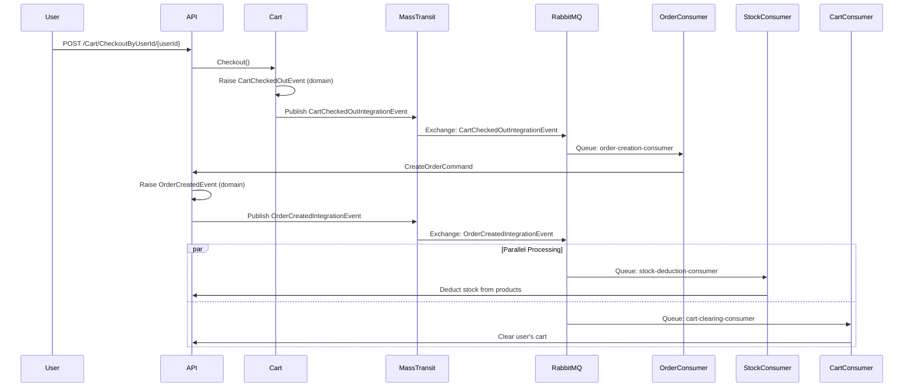

# Product Management API

A comprehensive e-commerce backend system built with .NET 8, implementing Clean Architecture, Domain-Driven Design (DDD), and event-driven patterns with **MassTransit + RabbitMQ** for asynchronous processing.

## 📋 Table of Contents

- [Features](#-features)
- [Architecture](#-architecture)
- [Technologies](#-technologies)
- [Getting Started](#-getting-started)
- [API Documentation](#-api-documentation)
- [Event Flow](#-event-flow)
- [Project Structure](#-project-structure)
- [Design Patterns](#-design-patterns)
- [Testing the API](#-testing-the-api)
- [Configuration](#-configuration)
- [Message Queue Documentation](#-message-queue-documentation)
- [Contributing](#-contributing)
- [Contact](#-contact)

## ✨ Features

### Product Management
- Complete CRUD operations for products
- Advanced stock management with **reservation system**
  - **Available stock**: What can be added to carts
  - **Reserved stock**: Currently in user carts
  - **Total stock**: Overall inventory
- Stock operations: Add, Deduct, Reserve, Release, Update
- Category-based product organization
- Price management with multi-currency support

### Category Management
- Create, read, update, and delete categories
- Automatic product count tracking per category
- Prevent deletion of categories with existing products
- Domain events for category lifecycle

### Shopping Cart
- **In-memory cart storage** per user (high performance)
- Add, remove, and update cart items
- **Automatic stock reservation** when items are added
  - Prevents overselling
  - Real-time availability checking
- **Automatic stock release** when items are removed or quantities reduced
- Cart checkout with comprehensive validation
- Domain events for all cart operations

### Order Management
- **Event-driven order creation** from cart checkout
- Order status state machine:
  - `Pending` → `Confirmed` → `Processing` → `Completed`
  - Or `Cancelled`/`Failed` states
- Order cancellation with reason tracking
- User-specific order history with pagination
- **Automatic stock deduction** upon order creation via message queue
- Support for failed order handling

### Event-Driven Architecture with MassTransit
- **Domain events** for internal business logic separation
- **Integration events** for cross-context communication
- **MassTransit 8.5.5** as messaging abstraction layer
- **RabbitMQ** as message broker
- **Automatic topology management** (exchanges, queues, bindings)
- **Built-in retry policies** with exponential backoff
- **Async event processing** for:
  - Cart checkout → Order creation
  - Order creation → Stock deduction (parallel)
  - Order creation → Cart clearing (parallel)
- **No manual background services** required (MassTransit handles lifecycle)
- **67% reduction in messaging code** compared to custom implementation

## 🏗️ Architecture

This project follows **Clean Architecture** principles with clear separation of concerns:

```
┌─────────────────────────────────────────────────┐
│           API Layer (Presentation)              │
│     Controllers, Middleware, Configuration      │
└────────────────────┬────────────────────────────┘
                     │
┌────────────────────▼────────────────────────────┐
│        Application Layer (Use Cases)            │
│  Commands, Queries, Handlers, DTOs, Validators │
│     Event Handlers, Integration Events          │
└────────────────────┬────────────────────────────┘
                     │
┌────────────────────▼────────────────────────────┐
│           Domain Layer (Entities)               │
│ Aggregates, Entities, Value Objects, Events    │
│        Business Logic Encapsulation             │
└─────────────────────────────────────────────────┘
                     │
┌────────────────────▼────────────────────────────┐
│      Infrastructure Layer (External)            │
│  EF Core, Repositories, MassTransit, RabbitMQ  │
│        Messaging, Persistence, Consumers        │
└─────────────────────────────────────────────────┘
```

### Key Architectural Decisions

- **Domain-Driven Design**: Rich domain models with business logic encapsulation
- **CQRS Pattern**: Separate read and write operations using MediatR
- **Event Sourcing**: Domain events for tracking state changes
- **Repository Pattern**: Abstraction over data access
- **Value Objects**: Immutable objects for domain concepts (Money, ProductName, Stock, etc.)
- **Aggregate Roots**: Transactional boundaries (Product, Category, Cart, Order)
- **Event-Driven Architecture**: Async processing via MassTransit + RabbitMQ
- **Publish/Subscribe Pattern**: Decoupled event consumers

## 🛠️ Technologies

### Backend
- **.NET 8** - Latest LTS version
- **ASP.NET Core Web API** - RESTful API framework
- **Entity Framework Core 8** - ORM for database operations
- **SQLite** - Lightweight database for development

### Messaging & Events
- **MassTransit 8.5.5** - Messaging abstraction framework
- **MassTransit.RabbitMQ 8.5.5** - RabbitMQ transport
- **RabbitMQ.Client 7.1.2** - Message broker client
- **MassTransit.Abstractions** - Publisher interfaces

### Libraries & Frameworks
- **MediatR 12.2.0** - CQRS implementation & in-process messaging
- **FluentValidation 11.8.1** - Input validation
- **Swashbuckle 6.6.2** - Swagger/OpenAPI documentation

### Patterns & Practices
- Clean Architecture
- Domain-Driven Design (DDD)
- CQRS (Command Query Responsibility Segregation)
- Event-Driven Architecture
- Repository Pattern
- Unit of Work Pattern
- Aggregate Pattern
- Value Object Pattern
- Domain Events Pattern
- Integration Events Pattern
- Publish/Subscribe Pattern

## 🚀 Getting Started

### Prerequisites

- [.NET 8 SDK](https://dotnet.microsoft.com/download/dotnet/8.0) (or later)
- [RabbitMQ](https://www.rabbitmq.com/download.html) (or use Docker)
- IDE: Visual Studio 2022, VS Code, or JetBrains Rider

### Installation

1. **Clone the repository**
   ```bash
   git clone https://github.com/A7medEmbaby/ProductManagementAPI.git
   cd ProductManagementAPI
   ```

2. **Start RabbitMQ** (using Docker - recommended)
   ```bash
   docker run -d --name rabbitmq \
     -p 5672:5672 \
     -p 15672:15672 \
     rabbitmq:3-management
   ```
   - **RabbitMQ Broker**: `amqp://localhost:5672`
   - **Management UI**: http://localhost:15672 (username: `guest`, password: `guest`)

3. **Restore NuGet packages**
   ```bash
   dotnet restore ProductManagement.sln
   ```

4. **Update connection strings** (optional)
   - Edit `ProductManagement.Api/appsettings.json` or `appsettings.Development.json`
   - SQLite database path: `Data Source=../Database/ProductManagement.db`
   - RabbitMQ settings:
     ```json
     {
       "RabbitMQ": {
         "Host": "rabbitmq://localhost",
         "Username": "guest",
         "Password": "guest"
       }
     }
     ```

5. **Apply database migrations**
   ```bash
   cd ProductManagement.Api
   dotnet ef database update
   ```

6. **Build the solution**
   ```bash
   dotnet build ProductManagement.sln
   ```

7. **Run the application**
   ```bash
   dotnet run --project ProductManagement.Api
   ```

8. **Access Swagger UI**
   - **HTTPS**: https://localhost:7129/swagger
   - **HTTP**: http://localhost:5008/swagger

### Verify RabbitMQ Integration

After starting the API, check the RabbitMQ Management UI:
1. Navigate to http://localhost:15672
2. Go to **Queues** tab
3. You should see MassTransit-managed queues:
   - `order-creation-consumer`
   - `stock-deduction-consumer`
   - `cart-clearing-consumer`

## 📚 API Documentation

### Categories

| Method | Endpoint | Description |
|--------|----------|-------------|
| GET | `/api/Categories/GetAllCategories` | Get all categories with product counts |
| GET | `/api/Categories/GetCategoryById/{id}` | Get category by ID |
| POST | `/api/Categories/CreateCategory` | Create new category |
| PUT | `/api/Categories/UpdateCategoryById/{id}` | Update category name |
| DELETE | `/api/Categories/DeleteCategoryById/{id}` | Delete category (if no products) |

### Products

| Method | Endpoint | Description |
|--------|----------|-------------|
| GET | `/api/Products/GetAllProducts` | Get paginated products |
| GET | `/api/Products/GetProductBy/{id}` | Get product by ID with stock details |
| GET | `/api/Products/GetProductsByCategoryId/{categoryId}` | Get products by category |
| POST | `/api/Products/CreateProduct` | Create new product |
| PUT | `/api/Products/UpdateProductById/{id}` | Update product details |
| DELETE | `/api/Products/DeleteProductById/{id}` | Delete product |
| POST | `/api/Products/AddProductStockById/{id}` | Add stock to product |
| POST | `/api/Products/DeductProductStockById/{id}` | Deduct stock (permanent) |
| POST | `/api/Products/ReserveProductStockById/{id}` | Reserve stock (cart) |
| POST | `/api/Products/ReleaseProductStockById/{id}` | Release reserved stock |
| PUT | `/api/Products/UpdateProductStockById/{id}` | Update total stock quantity |

### Cart

| Method | Endpoint | Description |
|--------|----------|-------------|
| GET | `/api/Cart/GetCartByUserId/{userId}` | Get user's cart with items |
| POST | `/api/Cart/AddItemByUserId/{userId}` | Add item to cart (auto-reserves stock) |
| DELETE | `/api/Cart/RemoveItem/{userId}/{itemId}` | Remove item (auto-releases stock) |
| PUT | `/api/Cart/UpdateItemQuantity/{userId}/{itemId}` | Update quantity (adjusts reservation) |
| DELETE | `/api/Cart/ClearCartByUserId/{userId}` | Clear entire cart (releases all stock) |
| POST | `/api/Cart/CheckoutByUserId/{userId}` | **Checkout cart** (triggers order flow) |

### Orders

| Method | Endpoint | Description |
|--------|----------|-------------|
| GET | `/api/Orders/GetAllOrders` | Get paginated orders |
| GET | `/api/Orders/GetOrderById/{id}` | Get order by ID with items |
| GET | `/api/Orders/GetOrdersByUserId/{userId}` | Get user's order history |
| POST | `/api/Orders/CreateOrder` | Create order manually |
| PUT | `/api/Orders/ConfirmOrder/{id}` | Confirm order (Pending → Confirmed) |
| PUT | `/api/Orders/CompleteOrder/{id}` | Complete order (Processing → Completed) |
| PUT | `/api/Orders/CancelOrder/{id}` | Cancel order with reason |

## 🔄 Event Flow

### Cart Checkout to Order Creation (Async Event-Driven)



### MassTransit Consumers (Managed Automatically)

1. **OrderCreationConsumer**
   - **Consumes**: `CartCheckedOutIntegrationEvent`
   - **Action**: Creates order from checked-out cart items
   - **Queue**: `order-creation-consumer` (auto-created by MassTransit)
   - **Error Handling**: 3 retry attempts with exponential backoff (1s, 2s, 4s)

2. **StockDeductionConsumer**
   - **Consumes**: `OrderCreatedIntegrationEvent`
   - **Action**: Deducts stock permanently from products in the order
   - **Queue**: `stock-deduction-consumer` (auto-created)
   - **Error Handling**: Collects failures and throws if any item fails

3. **CartClearingConsumer**
   - **Consumes**: `OrderCreatedIntegrationEvent`
   - **Action**: Clears user's cart after successful order creation
   - **Queue**: `cart-clearing-consumer` (auto-created)
   - **Runs in Parallel**: Executes concurrently with StockDeductionConsumer

### Domain Events (Internal)

**Cart Domain Events**:
- `CartItemAddedEvent` → Reserves product stock
- `CartItemRemovedEvent` → Releases product stock
- `CartItemQuantityUpdatedEvent` → Adjusts stock reservation
- `CartClearedEvent` → Releases all reserved stock
- `CartCheckedOutEvent` → Publishes integration event

**Order Domain Events**:
- `OrderCreatedEvent` → Publishes integration event
- `OrderConfirmedEvent`
- `OrderCompletedEvent`
- `OrderCancelledEvent`
- `OrderFailedEvent`

**Product Domain Events**:
- `ProductCreatedEvent`
- `ProductUpdatedEvent`
- `StockAddedEvent`
- `StockDeductedEvent`
- `StockReservedEvent`
- `StockReleasedEvent`

## 📁 Project Structure

```
ProductManagement/
├── ProductManagement.Domain/           # Domain layer (Pure business logic)
│   ├── Cart/                          # Cart aggregate
│   │   ├── Cart.cs                    # Aggregate root
│   │   ├── CartItem.cs                # Entity
│   │   ├── ValueObjects/              # Cart-specific value objects
│   │   └── Events/                    # Domain events
│   ├── Categories/                    # Category aggregate
│   │   ├── Category.cs
│   │   └── Events/
│   ├── Orders/                        # Order aggregate
│   │   ├── Order.cs
│   │   ├── OrderItem.cs
│   │   └── Events/
│   ├── Products/                      # Product aggregate
│   │   ├── Product.cs
│   │   ├── ValueObjects/              # Money, Stock, ProductName
│   │   └── Events/
│   └── Common/                        # Shared domain concepts
│       ├── Models/                    # Base classes
│       │   ├── Entity.cs
│       │   ├── AggregateRoot.cs
│       │   ├── ValueObject.cs
│       │   └── IDomainEvent.cs
│       └── ValueObjects/              # Shared value objects (ProductId, etc.)
│
├── ProductManagement.Application/     # Application layer (Use cases)
│   ├── Cart/
│   │   ├── Commands/                  # AddItemToCart, RemoveItem, Checkout
│   │   ├── Queries/                   # GetCart
│   │   ├── Handlers/                  # Command/query handlers
│   │   ├── EventHandlers/             # Domain event handlers
│   │   │   ├── CartCheckedOutEventHandler.cs    # Publishes integration event
│   │   │   ├── CartItemAddedEventHandler.cs     # Reserves stock
│   │   │   ├── CartItemRemovedEventHandler.cs   # Releases stock
│   │   │   ├── CartItemQuantityUpdatedEventHandler.cs
│   │   │   └── CartClearedEventHandler.cs
│   │   ├── DTOs/
│   │   └── Validators/
│   ├── Categories/                    # Category use cases
│   ├── Orders/                        # Order use cases
│   │   └── EventHandlers/
│   │       └── OrderCreatedEventHandler.cs      # Publishes integration event
│   ├── Products/                      # Product use cases
│   ├── IntegrationEvents/             # Cross-context events
│   │   ├── CartCheckedOutIntegrationEvent.cs
│   │   └── OrderCreatedIntegrationEvent.cs
│   └── Common/
│       └── Behaviors/                 # MediatR pipeline behaviors
│           └── ValidationBehavior.cs
│
├── ProductManagement.Infrastructure/  # Infrastructure layer
│   ├── Configurations/                # EF Core entity configurations
│   ├── Repositories/                  # Repository implementations
│   │   ├── ProductRepository.cs
│   │   ├── CategoryRepository.cs
│   │   ├── OrderRepository.cs
│   │   └── InMemoryCartRepository.cs  # In-memory cart (with domain event publishing)
│   ├── Messaging/
│   │   └── Consumers/                 # MassTransit consumers
│   │       ├── OrderCreationConsumer.cs       # Implements IConsumer<T>
│   │       ├── StockDeductionConsumer.cs
│   │       └── CartClearingConsumer.cs
│   ├── Persistence/
│   │   ├── ProductManagementDbContext.cs
│   │   └── Interceptors/
│   │       └── PublishDomainEventsInterceptor.cs  # Auto-publishes domain events
│   ├── Migrations/                    # EF Core migrations
│   └── DependencyInjection.cs         # MassTransit configuration
│
├── ProductManagement.Contracts/       # API contracts (DTOs)
│   ├── Cart/
│   ├── Categories/
│   ├── Orders/
│   ├── Products/
│   └── Common/
│       └── APIResponse.cs
│
└── ProductManagement.Api/             # API layer (Presentation)
    ├── Controllers/
    │   ├── CartController.cs
    │   ├── CategoriesController.cs
    │   ├── ProductsController.cs
    │   └── OrdersController.cs
    ├── Middleware/
    │   ├── GlobalExceptionMiddleware.cs
    │   └── ValidationMiddleware.cs
    └── Program.cs                     # Application entry point
```

## 🎨 Design Patterns

### Domain Layer Patterns

- **Aggregate Root**: `Product`, `Category`, `Cart`, `Order`
  - Transactional boundaries
  - Consistency enforcement
- **Entity**: `CartItem`, `OrderItem`
  - Identity-based equality
- **Value Objects**:
  - `ProductName`, `CategoryName` (with validation)
  - `Money` (amount + currency)
  - `Stock` (quantity + reserved)
  - `ProductId`, `OrderId`, `CartId`, `CategoryId` (strongly-typed IDs)
- **Domain Events**:
  - `ProductCreatedEvent`, `CartCheckedOutEvent`, `OrderCreatedEvent`
  - Raised within aggregates, published via MediatR

### Application Layer Patterns

- **CQRS**: Commands and Queries separated
  - Commands: Write operations (e.g., `CreateProductCommand`)
  - Queries: Read operations (e.g., `GetProductQuery`)
- **Mediator Pattern**: MediatR for in-process messaging
- **Validation Pipeline**: FluentValidation with MediatR behavior
- **Event Handler Pattern**: Domain event handlers convert to integration events
- **DTO Mapping**: Extension methods for entity-to-DTO conversion

### Infrastructure Layer Patterns

- **Repository Pattern**: Abstraction over data access
  - `IProductRepository`, `ICartRepository`, etc.
- **Unit of Work**: EF Core `DbContext`
- **Interceptor Pattern**:
  - `PublishDomainEventsInterceptor` - Auto-publishes events before `SaveChanges`
- **Message Bus Pattern**: MassTransit abstracts RabbitMQ
- **Consumer Pattern**: `IConsumer<T>` for message consumption
- **Scoped Dependency Injection**: Proper scope management for consumers

### Messaging Patterns

- **Publish/Subscribe**: One event → Multiple consumers
  - `OrderCreatedIntegrationEvent` → `StockDeductionConsumer` + `CartClearingConsumer`
- **Point-to-Point**: One event → One consumer
  - `CartCheckedOutIntegrationEvent` → `OrderCreationConsumer`
- **Retry Pattern**: Exponential backoff (1s → 2s → 4s)
- **Error Queue**: Failed messages moved to `{queue-name}_error`

## 🧪 Testing the API

### Example: Complete E-Commerce Flow

```bash
# Set base URL
BASE_URL="https://localhost:7129"

# 1. Create a category
curl -X POST "$BASE_URL/api/Categories/CreateCategory" \
  -H "Content-Type: application/json" \
  -d '{"name": "Electronics"}'
# Response: { "categoryId": "..." }

# 2. Create a product with initial stock
curl -X POST "$BASE_URL/api/Products/CreateProduct" \
  -H "Content-Type: application/json" \
  -d '{
    "name": "Laptop",
    "categoryId": "{category-id-from-step-1}",
    "price": 999.99,
    "currency": "USD",
    "initialStock": 10
  }'
# Response: { "productId": "..." }

# 3. Check product stock (should show: total=10, available=10, reserved=0)
curl -X GET "$BASE_URL/api/Products/GetProductBy/{product-id}"

# 4. Add item to cart (auto-reserves stock)
curl -X POST "$BASE_URL/api/Cart/AddItemByUserId/{user-id}" \
  -H "Content-Type: application/json" \
  -d '{
    "productId": "{product-id}",
    "quantity": 2
  }'

# 5. Check product stock again (should show: total=10, available=8, reserved=2)
curl -X GET "$BASE_URL/api/Products/GetProductBy/{product-id}"

# 6. Get cart (verify items are in cart)
curl -X GET "$BASE_URL/api/Cart/GetCartByUserId/{user-id}"

# 7. Checkout cart (triggers async event-driven flow)
curl -X POST "$BASE_URL/api/Cart/CheckoutByUserId/{user-id}"

# Wait 1-2 seconds for async processing...

# 8. Check orders (should have new order with status "Pending")
curl -X GET "$BASE_URL/api/Orders/GetOrdersByUserId/{user-id}"

# 9. Check cart is cleared
curl -X GET "$BASE_URL/api/Cart/GetCartByUserId/{user-id}"
# Response: Empty cart

# 10. Check product stock (should show: total=8, available=8, reserved=0)
# Stock was deducted permanently by StockDeductionConsumer
curl -X GET "$BASE_URL/api/Products/GetProductBy/{product-id}"
```

### Testing Stock Reservation

```bash
# Add multiple items to different carts
USER_1="user-123"
USER_2="user-456"

# User 1 adds 3 items (reserves 3)
curl -X POST "$BASE_URL/api/Cart/AddItemByUserId/$USER_1" \
  -H "Content-Type: application/json" \
  -d '{"productId": "{product-id}", "quantity": 3}'

# User 2 adds 5 items (reserves 5)
curl -X POST "$BASE_URL/api/Cart/AddItemByUserId/$USER_2" \
  -H "Content-Type: application/json" \
  -d '{"productId": "{product-id}", "quantity": 5}'

# Check stock: total=10, available=2, reserved=8
curl -X GET "$BASE_URL/api/Products/GetProductBy/{product-id}"

# User 2 removes from cart (releases 5)
curl -X DELETE "$BASE_URL/api/Cart/ClearCartByUserId/$USER_2"

# Check stock: total=10, available=7, reserved=3
curl -X GET "$BASE_URL/api/Products/GetProductBy/{product-id}"
```

## 📝 Configuration

### RabbitMQ Settings (`appsettings.json`)

**New (MassTransit - Simplified)**:
```json
{
  "RabbitMQ": {
    "Host": "rabbitmq://localhost",
    "Username": "guest",
    "Password": "guest"
  }
}
```

**Benefits of MassTransit Configuration**:
- ✅ 80% less configuration (4 lines vs 20 lines)
- ✅ No manual exchange/queue/routing key management
- ✅ Automatic topology creation
- ✅ Convention-based naming
- ✅ Easy to switch transports (Azure Service Bus, Amazon SQS, etc.)

### Database Configuration

```json
{
  "ConnectionStrings": {
    "DefaultConnection": "Data Source=../Database/ProductManagement.db"
  }
}
```

### Logging Configuration

```json
{
  "Logging": {
    "LogLevel": {
      "Default": "Information",
      "Microsoft.AspNetCore": "Warning",
      "Microsoft.EntityFrameworkCore": "Warning",
      "MassTransit": "Information"
    }
  }
}
```

## 📖 Message Queue Documentation

For detailed documentation on the message queue implementation, migration from custom RabbitMQ to MassTransit, and architectural decisions, see:

**[📄 Message Queue Documentation](MessageQueue-Documentation.md)**

This document includes:
- Complete event flow diagrams
- Step-by-step processing breakdown
- Old vs New implementation comparison
- MassTransit best practices
- Troubleshooting guide
- Monitoring with RabbitMQ Management UI

## 🤝 Contributing

Contributions are welcome! Please follow these steps:

1. Fork the repository
2. Create a feature branch (`git checkout -b feature/AmazingFeature`)
3. Commit your changes (`git commit -m 'Add some AmazingFeature'`)
4. Push to the branch (`git push origin feature/AmazingFeature`)
5. Open a Pull Request

### Development Guidelines

- Follow Clean Architecture principles
- Write unit tests for domain logic
- Use FluentValidation for input validation
- Follow SOLID principles
- Use domain events for cross-aggregate communication
- Document public APIs with XML comments

## 📄 License

This project is licensed under the MIT License - see the [LICENSE](LICENSE) file for details.

## 📧 Contact

**Ahmed Mohamed Embaby**

- 📧 Email: [a7medembaby@gmail.com](mailto:a7medembaby@gmail.com)
- 💼 LinkedIn: [ahmed-m-embaby](https://www.linkedin.com/in/ahmed-m-embaby/)
- 🐙 GitHub: [A7medEmbaby](https://github.com/A7medEmbaby/)
- 📱 WhatsApp: [+201128537428](https://wa.me/201128537428)
- ☎️ Phone: +201128537428

---

## 🌟 Key Highlights

- ✅ **Clean Architecture** with DDD principles
- ✅ **Event-Driven** with MassTransit + RabbitMQ
- ✅ **CQRS** with MediatR
- ✅ **Automatic Stock Reservation** when adding to cart
- ✅ **Async Order Processing** with retry and error handling
- ✅ **67% Reduction** in messaging infrastructure code
- ✅ **Production-Ready** error handling and logging
- ✅ **Comprehensive API** documentation via Swagger

⭐ **If you found this project helpful, please consider giving it a star!**

---

**Built with ❤️ using .NET 8, MassTransit, and Clean Architecture**
