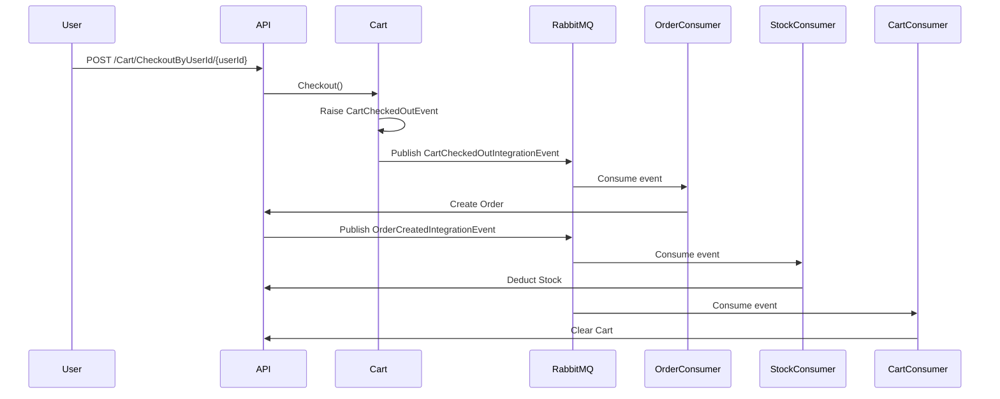

# Product Management API

A comprehensive e-commerce backend system built with .NET 8, implementing Clean Architecture, Domain-Driven Design (DDD), and event-driven patterns with RabbitMQ for asynchronous processing.

## 📋 Table of Contents

- [Features](#-features)
- [Architecture](#-architecture)
- [Technologies](#-technologies)
- [Getting Started](#-getting-started)
- [API Documentation](#-api-documentation)
- [Event Flow](#-event-flow)
- [Project Structure](#-project-structure)
- [Design Patterns](#-design-patterns)
- [Contact](#-contact)

## ✨ Features

### Product Management
- Complete CRUD operations for products
- Stock management with reservation system
- Available, reserved, and total quantity tracking
- Category-based product organization
- Price management with currency support

### Category Management
- Create, read, update, and delete categories
- Automatic product count tracking
- Prevent deletion of categories with products

### Shopping Cart
- In-memory cart storage per user
- Add, remove, and update cart items
- Automatic stock reservation when items are added
- Stock release when items are removed or quantities reduced
- Cart checkout with validation

### Order Management
- Create orders from cart checkout
- Order status workflow: Pending → Confirmed → Processing → Completed
- Order cancellation with reason tracking
- User-specific order history with pagination
- Automatic stock deduction upon order creation

### Event-Driven Architecture
- Domain events for business logic separation
- RabbitMQ integration for async processing
- Background services for event consumption
- Automatic cart clearing after order creation
- Stock deduction processing via message queues

## 🏗️ Architecture

This project follows **Clean Architecture** principles with clear separation of concerns:

```
┌─────────────────────────────────────────────────┐
│              API Layer (Presentation)           │
│  Controllers, Middleware, Background Services   │
└────────────────────┬────────────────────────────┘
                     │
┌────────────────────▼────────────────────────────┐
│           Application Layer (Use Cases)         │
│  Commands, Queries, Handlers, DTOs, Validators │
└────────────────────┬────────────────────────────┘
                     │
┌────────────────────▼────────────────────────────┐
│              Domain Layer (Entities)            │
│  Aggregates, Entities, Value Objects, Events    │
└─────────────────────────────────────────────────┘
                     │
┌────────────────────▼────────────────────────────┐
│         Infrastructure Layer (External)         │
│   EF Core, Repositories, RabbitMQ, Persistence  │
└─────────────────────────────────────────────────┘
```

### Key Architectural Decisions

- **Domain-Driven Design**: Rich domain models with business logic encapsulation
- **CQRS Pattern**: Separate read and write operations using MediatR
- **Event Sourcing**: Domain events for tracking state changes
- **Repository Pattern**: Abstraction over data access
- **Value Objects**: Immutable objects for domain concepts (Money, ProductName, etc.)

## 🛠️ Technologies

### Backend
- **.NET 8** - Latest LTS version
- **ASP.NET Core Web API** - RESTful API framework
- **Entity Framework Core 8** - ORM for database operations
- **SQLite** - Lightweight database for development

### Libraries & Frameworks
- **MediatR** (12.2.0) - CQRS implementation
- **FluentValidation** (11.8.1) - Input validation
- **RabbitMQ.Client** (6.8.1) - Message broker integration
- **Swashbuckle** (6.6.2) - Swagger/OpenAPI documentation

### Patterns & Practices
- Clean Architecture
- Domain-Driven Design (DDD)
- CQRS (Command Query Responsibility Segregation)
- Event-Driven Architecture
- Repository Pattern
- Unit of Work Pattern

## 🚀 Getting Started

### Prerequisites

- [.NET 8 SDK](https://dotnet.microsoft.com/download/dotnet/8.0)
- [RabbitMQ](https://www.rabbitmq.com/download.html) (or use Docker)
- IDE (Visual Studio 2022, VS Code, or Rider)

### Installation

1. **Clone the repository**
   ```bash
   git clone https://github.com/A7medEmbaby/ProductManagementAPI.git
   cd ProductManagementAPI
   ```

2. **Start RabbitMQ** (using Docker)
   ```bash
   docker run -d --name rabbitmq -p 5672:5672 -p 15672:15672 rabbitmq:3-management
   ```
   - Management UI: http://localhost:15672 (guest/guest)

3. **Update connection strings** (if needed)
   - Edit `ProductManagement.Api/appsettings.Development.json`
   - SQLite database path: `Data Source=../Database/ProductManagement.db`

4. **Apply database migrations**
   ```bash
   cd ProductManagement.Api
   dotnet ef database update
   ```

5. **Run the application**
   ```bash
   dotnet run --project ProductManagement.Api
   ```

6. **Access Swagger UI**
   - https://localhost:7129/swagger (HTTPS)
   - http://localhost:5008/swagger (HTTP)

## 📚 API Documentation

### Categories

| Method | Endpoint | Description |
|--------|----------|-------------|
| GET | `/api/Categories/GetAllCategories` | Get all categories |
| GET | `/api/Categories/GetCategoryById/{id}` | Get category by ID |
| POST | `/api/Categories/CreateCategory` | Create new category |
| PUT | `/api/Categories/UpdateCategoryById/{id}` | Update category |
| DELETE | `/api/Categories/DeleteCategoryById/{id}` | Delete category |

### Products

| Method | Endpoint | Description |
|--------|----------|-------------|
| GET | `/api/Products/GetAllProducts` | Get paginated products |
| GET | `/api/Products/GetProductBy/{id}` | Get product by ID |
| GET | `/api/Products/GetProductsByCategoryId/{categoryId}` | Get products by category |
| POST | `/api/Products/CreateProduct` | Create new product |
| PUT | `/api/Products/UpdateProductById/{id}` | Update product |
| DELETE | `/api/Products/DeleteProductById/{id}` | Delete product |
| POST | `/api/Products/AddProductStockById/{id}` | Add stock |
| POST | `/api/Products/DeductProductStockById/{id}` | Deduct stock |
| POST | `/api/Products/ReserveProductStockById/{id}` | Reserve stock |
| POST | `/api/Products/ReleaseProductStockById/{id}` | Release reserved stock |
| PUT | `/api/Products/UpdateProductStockById/{id}` | Update stock quantity |

### Cart

| Method | Endpoint | Description |
|--------|----------|-------------|
| GET | `/api/Cart/GetCartByUserId/{userId}` | Get user's cart |
| POST | `/api/Cart/AddItemByUserId/{userId}` | Add item to cart |
| DELETE | `/api/Cart/RemoveItem/{userId}/{itemId}` | Remove item from cart |
| PUT | `/api/Cart/UpdateItemQuantity/{userId}/{itemId}` | Update item quantity |
| DELETE | `/api/Cart/ClearCartByUserId/{userId}` | Clear cart |
| POST | `/api/Cart/CheckoutByUserId/{userId}` | Checkout cart |

### Orders

| Method | Endpoint | Description |
|--------|----------|-------------|
| GET | `/api/Orders/GetAllOrders` | Get paginated orders |
| GET | `/api/Orders/GetOrderById/{id}` | Get order by ID |
| GET | `/api/Orders/GetOrdersByUserId/{userId}` | Get user's orders |
| POST | `/api/Orders/CreateOrder` | Create new order |
| PUT | `/api/Orders/ConfirmOrder/{id}` | Confirm order |
| PUT | `/api/Orders/CompleteOrder/{id}` | Complete order |
| PUT | `/api/Orders/CancelOrder/{id}` | Cancel order |

## 🔄 Event Flow

### Cart Checkout to Order Creation



### Background Services

1. **OrderCreationBackgroundService**
   - Listens to: `CartCheckedOutIntegrationEvent`
   - Action: Creates orders from checked-out carts
   - Queue: `order.creation.queue`

2. **StockDeductionBackgroundService**
   - Listens to: `OrderCreatedIntegrationEvent`
   - Action: Deducts stock from products in the order
   - Queue: `stock.deduction.queue`

3. **CartClearingBackgroundService**
   - Listens to: `OrderCreatedIntegrationEvent`
   - Action: Clears user's cart after order creation
   - Queue: `cart.clearing.queue`

## 📁 Project Structure

```
ProductManagement/
├── ProductManagement.Domain/           # Domain layer
│   ├── Cart/                          # Cart aggregate
│   ├── Categories/                    # Category aggregate
│   ├── Orders/                        # Order aggregate
│   ├── Products/                      # Product aggregate
│   └── Common/                        # Shared domain concepts
│       ├── Models/                    # Base classes (Entity, AggregateRoot, ValueObject)
│       └── ValueObjects/              # Shared value objects
│
├── ProductManagement.Application/     # Application layer
│   ├── Cart/                          # Cart use cases
│   │   ├── Commands/
│   │   ├── Queries/
│   │   ├── Handlers/
│   │   ├── EventHandlers/
│   │   ├── DTOs/
│   │   └── Validators/
│   ├── Categories/                    # Category use cases
│   ├── Orders/                        # Order use cases
│   ├── Products/                      # Product use cases
│   ├── Common/                        # Shared application concerns
│   │   └── Behaviors/                 # MediatR pipeline behaviors
│   └── IntegrationEvents/             # Integration events
│
├── ProductManagement.Infrastructure/  # Infrastructure layer
│   ├── Configurations/                # EF Core configurations
│   ├── Repositories/                  # Repository implementations
│   ├── Messaging/                     # RabbitMQ implementation
│   │   ├── Consumers/                 # Event consumers
│   │   └── RabbitMQMessageBus.cs
│   ├── Persistence/                   # Database context
│   └── Migrations/                    # EF Core migrations
│
├── ProductManagement.Contracts/       # API contracts
│   ├── Cart/                          # Cart request/response DTOs
│   ├── Categories/                    # Category request/response DTOs
│   ├── Orders/                        # Order request/response DTOs
│   ├── Products/                      # Product request/response DTOs
│   └── Common/                        # Shared contracts
│
└── ProductManagement.Api/             # API layer
    ├── Controllers/                   # API controllers
    ├── Middleware/                    # Custom middleware
    ├── BackgroundServices/            # Hosted services
    └── Program.cs                     # Application entry point
```

## 🎨 Design Patterns

### Domain Layer Patterns

- **Aggregate Root**: Product, Category, Cart, Order
- **Entity**: CartItem, OrderItem
- **Value Objects**: ProductName, CategoryName, Money, Stock, ProductId
- **Domain Events**: ProductCreatedEvent, CartCheckedOutEvent, OrderCreatedEvent

### Application Layer Patterns

- **CQRS**: Commands and Queries separated
- **Mediator**: MediatR for request handling
- **Validation Pipeline**: FluentValidation with MediatR behavior
- **DTO Mapping**: Extension methods for entity-to-DTO conversion

### Infrastructure Layer Patterns

- **Repository Pattern**: Abstraction over data access
- **Unit of Work**: EF Core DbContext
- **Interceptor Pattern**: PublishDomainEventsInterceptor for automatic event publishing
- **Message Bus**: RabbitMQ for async communication

## 🧪 Testing the API

### Example: Complete E-Commerce Flow

```bash
# 1. Create a category
curl -X POST "https://localhost:7129/api/Categories/CreateCategory" \
  -H "Content-Type: application/json" \
  -d '{"name": "Electronics"}'

# 2. Create a product
curl -X POST "https://localhost:7129/api/Products/CreateProduct" \
  -H "Content-Type: application/json" \
  -d '{
    "name": "Laptop",
    "categoryId": "{category-id}",
    "price": 999.99,
    "currency": "USD",
    "initialStock": 10
  }'

# 3. Add item to cart
curl -X POST "https://localhost:7129/api/Cart/AddItemByUserId/{user-id}" \
  -H "Content-Type: application/json" \
  -d '{
    "productId": "{product-id}",
    "quantity": 2
  }'

# 4. Checkout cart (triggers order creation, stock deduction, cart clearing)
curl -X POST "https://localhost:7129/api/Cart/CheckoutByUserId/{user-id}"

# 5. Check order status
curl -X GET "https://localhost:7129/api/Orders/GetOrdersByUserId/{user-id}"
```

## 📝 Configuration

### RabbitMQ Settings (`appsettings.json`)

```json
{
  "RabbitMQ": {
    "HostName": "localhost",
    "Port": 5672,
    "UserName": "guest",
    "Password": "guest",
    "VirtualHost": "/",
    "Exchanges": {
      "CartEvents": "cart.events",
      "OrderEvents": "order.events"
    },
    "Queues": {
      "OrderCreation": "order.creation.queue",
      "StockDeduction": "stock.deduction.queue",
      "CartClearing": "cart.clearing.queue"
    },
    "RoutingKeys": {
      "CartCheckedOut": "cart.checkedout",
      "OrderCreated": "order.created"
    }
  }
}
```

## 🤝 Contributing

Contributions are welcome! Please feel free to submit a Pull Request.

## 📄 License

This project is licensed under the MIT License.

## 📧 Contact

**Ahmed Mohamed Embaby**

- 📧 Email: [a7medembaby@gmail.com](mailto:a7medembaby@gmail.com)
- 💼 LinkedIn: [ahmed-m-embaby](https://www.linkedin.com/in/ahmed-m-embaby/)
- 🐙 GitHub: [A7medEmbaby](https://github.com/A7medEmbaby/)
- 📱 WhatsApp: [+201128537428](https://wa.me/201128537428)
- ☎️ Phone: +201128537428

---

⭐ If you found this project helpful, please consider giving it a star!
